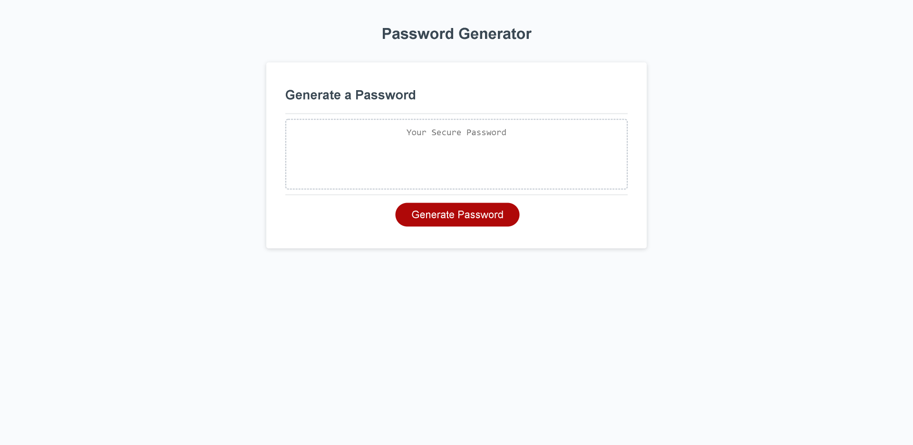
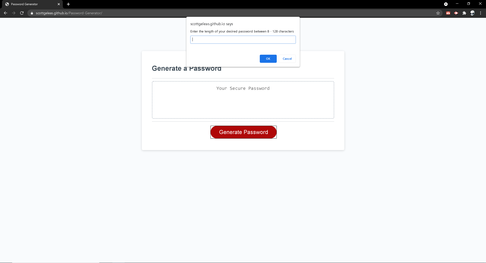
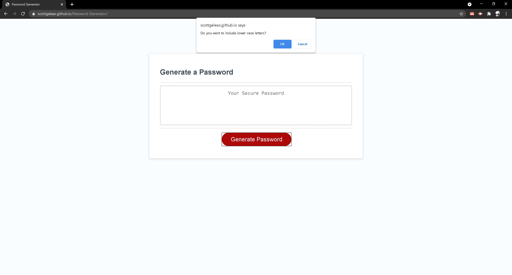
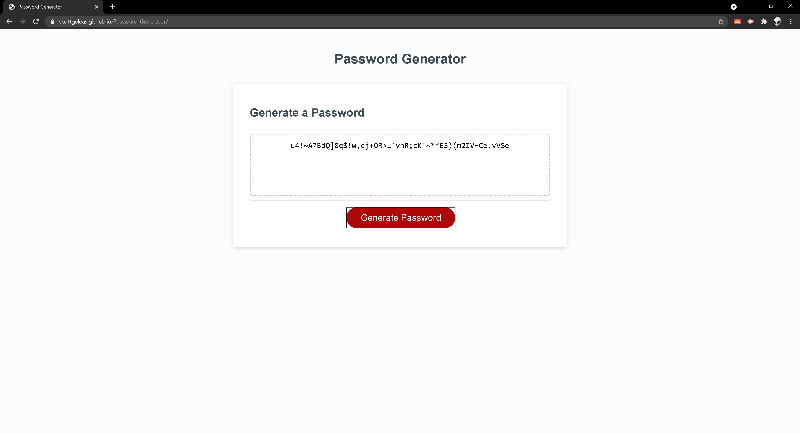

# Password Generator

 ## Description 
This is a password generator designed to let you customize how your password is generated.
You can customize the length, select from lower case letters, upper case letters, numbers, and symbols.
After you have entered a desired length, and chosen which characters to include in your password, javascript automatically randomizes through your characters selections making you a custom password with all of your requirements.    
These step are shown in the various screenshots below:


 ### Starting page ⤵️



### Length Input ⤵️



### Selecting a set ⤵️



### Password Generated and shown to page ⤵️


 ## Getting Started:
The page is live at https://scottgeleas.github.io/Password-Generator/.

 ## Prerequisites:
If you want to edit this web page you must have a Github account,    
and have also downloaded Visual Studio Code.

- Create a Github account here: [Github](https://github.com/)
- Download Visual Studio here: [Visual Studio](https://code.visualstudio.com/download/)
- Repository link: [Password Generator](https://github.com/scottgeleas/Password-Generator)

 ### Authors:
```
 Scott Geleas
```

 ### Built With:
```
- Javascript
- HTML
- CSS
- Visual Studio Code
```

 ### Acknowledgments:
```
University of New Hampshire Coding Bootcamp
```

 ### License: 
 ```
MIT License

Copyright (c) [2021] [Scott Geleas]]

Permission is hereby granted, free of charge, to any person obtaining a copy
of this software and associated documentation files (the "Software"), to deal
in the Software without restriction, including without limitation the rights
to use, copy, modify, merge, publish, distribute, sublicense, and/or sell
copies of the Software, and to permit persons to whom the Software is
furnished to do so, subject to the following conditions:

The above copyright notice and this permission notice shall be included in all
copies or substantial portions of the Software.

THE SOFTWARE IS PROVIDED "AS IS", WITHOUT WARRANTY OF ANY KIND, EXPRESS OR
IMPLIED, INCLUDING BUT NOT LIMITED TO THE WARRANTIES OF MERCHANTABILITY,
FITNESS FOR A PARTICULAR PURPOSE AND NONINFRINGEMENT. IN NO EVENT SHALL THE
AUTHORS OR COPYRIGHT HOLDERS BE LIABLE FOR ANY CLAIM, DAMAGES OR OTHER
LIABILITY, WHETHER IN AN ACTION OF CONTRACT, TORT OR OTHERWISE, ARISING FROM,
OUT OF OR IN CONNECTION WITH THE SOFTWARE OR THE USE OR OTHER DEALINGS IN THE
SOFTWARE.
```